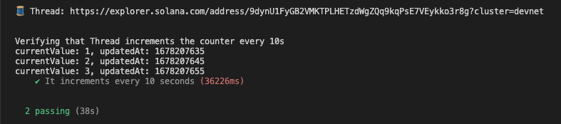

# 1. Counter

## Goals

In the [**previous guide**](https://docs.clockwork.xyz/developers/guides/you-first-automation-hello-clockwork), we learned how to automate a Solana program using the [**Clockwork Typescript SDK**](https://www.npmjs.com/package/@clockwork-xyz/sdk). In this guide, we will see how programs can create and manage **threads** directly by sending [**CPIs**](https://docs.solana.com/developing/programming-model/calling-between-programs#cross-program-invocations) to the [**thread program**](https://docs.rs/clockwork-thread-program/latest/clockwork\_thread\_program/).

1. Learn how to create and manage threads via CPIs.
2. Build an automated counter program that owns its own thread.
3. Secure our program against spam and unwanted callers.&#x20;

## 1. Building a counter program

```bash
anchor init counter
cd counter
```

Let's begin by opening up the program file located at `programs/counter/src/lib.rs`. Here, we'll build a simple counter program that tracks an incrementing integer.&#x20;

1. `struct Counter` – We start by defining a `Counter` account to hold our counter state.
2. `fn increment()` – We declare an instruction to increment the counter value.
3. `struct Increment<'info>` – We create an [**Anchor accounts struct**](https://www.anchor-lang.com/docs/the-accounts-struct) to setup constraints on the `increment` instruction.

```rust
use anchor_lang::prelude::*;

// 1️⃣ We define an account to hold our counter state
#[account]
pub struct Counter {
    pub current_value: u64, // the value of the counter
    pub updated_at: i64,    // last time the counter has been updated
}

#[program]
pub mod counter {
    use super::*;
    
    // 2️⃣ We define an instruction to mutate the `Counter`
    pub fn increment(ctx: Context<Increment>) -> Result<()> {    
        ctx.accounts.counter.current_value = ctx.accounts.counter.current_value.checked_add(1).unwrap();
        ctx.accounts.counter.updated_at = Clock::get().unwrap().unix_timestamp;
        Ok(())
    }
}

/// Seed for `Counter` account Program Derived Address
/// ⚠ Make sure it matches whatever you are using on the client-side
pub const SEED_COUNTER: &[u8] = b"counter";

// 3️⃣ We define constraints for the `increment` instruction with Anchor macros
#[derive(Accounts)]
pub struct Increment<'info> {
    /// The counter account.
    #[account(
        init_if_needed,
        payer = payer,
        seeds = [SEED_COUNTER],
        bump,
        space = 8 + std::mem::size_of::<Counter>(),
    )]
    pub counter: Account<'info, Counter>,   
    
    /// Payer for new account initializations.
    #[account(mut)]
    pub payer: Signer<'info>,
    
    /// Program authority (the owner of the thread).
    #[account(
        seeds = [PROGRAM_AUTHORITY_SEED],
        bump,
    )]
    pub program_authority: SystemAccount<'info>,
    
    /// The system program. 
    #[account(address = system_program::ID)]
    pub system_program: Program<'info, System>,
    
    // The thread account. 
    #[account(
        signer,
        constraint = thread.authority.eq(program_authority.key()
    )]
    pub thread: Account<'info, Thread>,
}
```

## 2. Getting familiar with the thread program

In the previous guide, we created threads using the Typescript SDK. In Solana, everything is an account and threads are no different. We were just asking the Clockwork thread program to create thread accounts for us. Similar to the Token Program maintained by the Solana team, the Clockwork Thread Program is a program deployed and maintained by the Clockwork team.

So instead of submitting transactions to the RPC, we can very well interact with that program using CPIs. Here's an example of instructions provided by the [**thread program**](https://docs.rs/clockwork-sdk/latest/clockwork\_sdk/cpi/index.html) via the [**Clockwork SDK**](https://crates.io/crates/clockwork-sdk) for programs.

* [`thread_create`](https://docs.rs/clockwork-sdk/latest/clockwork\_sdk/cpi/fn.thread\_create.html) – Create a Thread with a target instruction to run.
* [`thread_delete`](https://docs.rs/clockwork-sdk/latest/clockwork\_sdk/cpi/fn.thread\_delete.html) –  Delete a Thread and withdraw the funds.
* [`thread_pause`](https://docs.rs/clockwork-sdk/latest/clockwork\_sdk/cpi/fn.thread\_pause.html) – Pause a Thread execution.
* [`thread_resume`](https://docs.rs/clockwork-sdk/latest/clockwork\_sdk/cpi/fn.thread\_resume.html) – Resume a Thread execution.
* [`thread_update`](https://docs.rs/clockwork-sdk/latest/clockwork\_sdk/cpi/fn.thread\_update.html) – Update a Thread settings; instructions, triggers, etc.

## 3. Creating a thread via CPI

We will take the increment counter instruction and instead of running it by ourselves, we create a thread and make it increment the counter on our behalf. Let's create that thread, instead of crafting the instructions by hand, let's install the[ **Clockwork SDK**](https://crates.io/crates/clockwork-sdk):

```bash
cargo add clockwork-sdk@~2.0.1
```

Let's head back to our program file located at `programs/counter/src/lib.rs`, what follows are the typical steps to create a thread via CPI:

1. `target_ix` – We start by defining the instruction to run by our thread.
2. `trigger` – We define the conditions for our thread to wake and execute.
3. `clockwork_sdk::cpi::thread_create` – We use this helper to create thread CPI.

```rust
use anchor_lang::prelude::*;
use anchor_lang::InstructionData;
use anchor_lang::solana_program::{
    instruction::Instruction,
    native_token::LAMPORTS_PER_SOL,
    system_program
};

// 0️⃣ Import the Clockwork SDK.
use clockwork_sdk::state::{ThreadAccount};

...

pub mod counter {
    ...
    pub fn increment(ctx: Context<Increment>) -> Result<()> { ... }
    
    pub fn initialize(ctx: Context<Initialize>, thread_id: Vec<u8>)
     -> Result<()> {
        // Get accounts.
        let payer = &ctx.accounts.payer;
        let system_program = &ctx.accounts.system_program;
        let clockwork_program = &ctx.accounts.clockwork_program;
        let thread = &ctx.accounts.thread;
        let program_authority = &ctx.accounts.program_authority;
        let bump = *ctx.bumps.get("thread_authority").unwrap();
        let counter = &ctx.accounts.counter;
    
        // 1️⃣ Prepare an instruction to automate. 
        //    In this case, we will automate the Increment instruction.
        let target_ix = Instruction {
            program_id: ID,
            accounts: crate::accounts::Increment {
                counter: counter.key(),
                payer: clockwork_sdk::utils::PAYER_PUBKEY, // 👈 See note below
                program_authority: program_authority.key(),
                system_program: system_program.key(),
                thread: thread.key(),
            }.to_account_metas(Some(true)),
            data: crate::instruction::Increment {}.data(),
        };
    
        // 2️⃣ Define a trigger for the thread.
        let trigger = clockwork_sdk::state::Trigger::Cron {
            schedule: "*/10 * * * * * *".into(),
            skippable: true,
        };
    
        // 3️⃣ Create a Thread via CPI
        clockwork_sdk::cpi::thread_create(
            CpiContext::new_with_signer(
                clockwork_program.to_account_info(),
                clockwork_sdk::cpi::ThreadCreate {
                    authority: program_authority.to_account_info(),
                    payer: payer.to_account_info(),
                    system_program: system_program.to_account_info(),
                    thread: thread.to_account_info(),
                },
                &[&[THREAD_AUTHORITY_SEED, &[bump]]]
            ),
            2 * LAMPORTS_PER_SOL,       // Amount
            thread_id,                  // ID
            vec![target_ix.into()],     // Instructions
            trigger,                    // Trigger
        )?;
    
        Ok(())
    }
}


/// Seed for thread_authority pda
/// ⚠️ Make sure it matches whatever you are using on the client-side
pub const PROGRAM_AUTHORITY_SEED: &[u8] = b"authority";

#[derive(Accounts)]
#[instruction(thread_id: Vec < u8 >)]
pub struct Initialize<'info> {
    /// Who's paying for this CreateThread Transaction
    /// (not to be confused with the thread executions)
    #[account(mut)]
    pub payer: Signer<'info>,
    
    #[account(address = system_program::ID)]
    pub system_program: Program<'info, System>,

    /// Clockwork Program (Thread Program)
    #[account(address = clockwork_sdk::ID)]
    pub clockwork_program: Program<'info, clockwork_sdk::ThreadProgram>,

    /// Address to assign to the newly created Thread
    #[account(
        mut,
        address = clockwork_sdk::state::Thread::pubkey(thread_authority.key(), thread_id)
    )]
    pub thread: SystemAccount<'info>,

    /// Program authority (the owner of the thread)
    #[account(
        seeds = [PROGRAM_AUTHORITY_SEED],
        bump,
    )]
    pub program_authority: SystemAccount<'info>,

    #[account(
        mut,
        seeds = [SEED_COUNTER],
        bump,
    )]
    pub counter: Account<'info, Counter>,
}
```


Note the `clockwork_sdk::utils::PAYER_PUBKEY` this is essential for our thread to pay for the account created by the `increment` instruction and is explained in this [section](../threads/payers.md).


Finally, the trickiest part is to properly define our create thread instructions constraints with Anchor macros. Note that the thread [authority](../threads/authority.md) is a PDA account. Only this program has authority to administrate the thread; pause, start, create, delete the thread, etc.

## 4. Testing our automation

Let's add a test case to initialize our program and get it running. Here, we will simply calculate the required PDAs and call our program's `Initialize` instruction. From there, our program will create a thread and begin running all on its own.


```typescript
...
import { ClockworkProvider } from "@clockwork-xyz/sdk";

const clockworkProvider = new ClockworkProvider(wallet, provider.connection);

it("It increments every 10 seconds", async () => {    
    // 1️⃣ Prepare thread address
    const threadId = "counter";
    const [threadAuthority] = PublicKey.findProgramAddressSync(
        // Make sure it matches on the prog side
        [anchor.utils.bytes.utf8.encode("authority")], 
        program.programId
    );
    
    const [threadAddress, threadBump] = clockworkProvider.getThreadPDA(threadAuthority, threadId)
    
    // 2️⃣ Ask our program to create a thread via CPI
    // and thus become the admin of that thread
    await program.methods
        .initialize(Buffer.from(threadId))
        .accounts({
            systemProgram: SystemProgram.programId,
            clockworkProgram: clockworkProvider.threadProgram.programId,
            payer: wallet.publicKey,
            thread: threadAddress,
            threadAuthority: threadAuthority,
            counter: counter,
        })
        .rpc();
}
```


Finally, lets run the test using `anchor test`. You modify the test to print the thread address and lookup the thread in your favorite Solana explorer. You should see the counter being auto-increment every 10 seconds by our thread.

<figure><figcaption></figcaption></figure>

## Key Learnings

1. Programs can create threads via CPIs.&#x20;
2. When creating threads via CPIs, use a "program authority" PDA to act as the owner of the thread and mange its permissions.&#x20;
3. Use the [`PAYER_PUBKEY`](../threads/payers.md) address whenever an automated instruction needs to pay for a new account initialization.

## Appendix

This guide was written using the following environment dependencies.

| Dependency       | Version  |
| ---------------- | -------- |
| Anchor           | v0.26.0  |
| Clockwork        | v2.0.1   |
| Clockwork TS SDK | v0.2.3   |
| Rust             | v1.65.0  |
| Solana           | v1.14.15 |
| Ubuntu           | v20.04   |

## Learn more

* A complete copy of all code provided in this guide can be found in the [**examples repo**](https://github.com/clockwork-xyz/examples/tree/main/counter) on Github.
* Ask questions on [**Discord**](https://discord.gg/epHsTsnUre).
